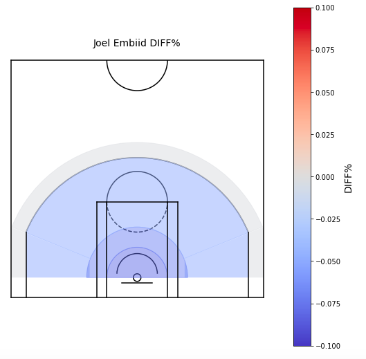
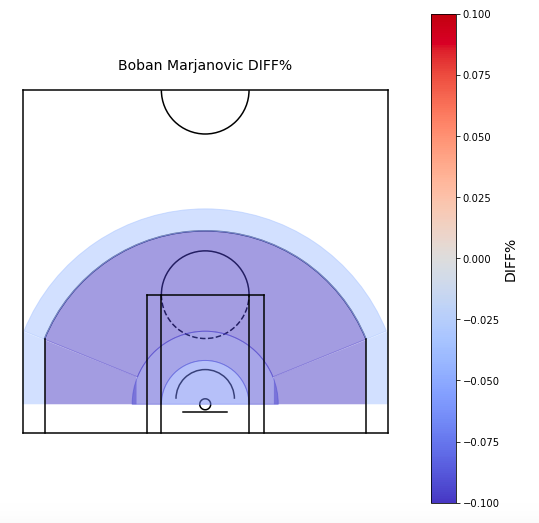

# defense
Visualizing and quantifying defensive impact

## Description

This repo contains a notebook (`visualize_defense.ipynb`) using the `playerdashptshotdefend` endpoint of the [stats.nba.com](https://stats.nba.com) API. With the `Player` and `League` classes from the `py_ball` package, the code here explores the defensive data for when a player is the closest defender to a field goal attempt.

## Results

The figures below show the `DIFF%` for Boban Marjanovic and Joel Embiid in the 2018-19 NBA Season. `DIFF%` is the difference between the field goal percentage when the given player is the closest defender and the expected field goal percentage. Therefore, negative values indicate better defense by the given player. The figures below are split into four sections (not necessarily exclusive): Less than 6ft, Less than 10ft, 2 pointers, and 3 pointers.

These figures indicate that Boban and Joel defend very well on 2 pointers, especially close to the basket.
